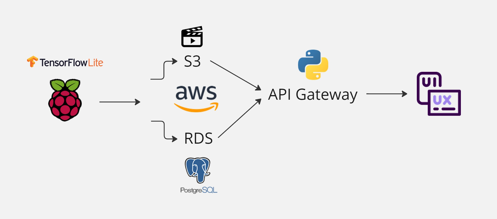

# Arquitetura da Solução

- Versão : 1.0.0

**Problema**  
A Abundance Brasil está em uma missão de revolucionar a conservação ambiental e nossa equipe irá transformar a maneira como contamos árvores em vastas áreas florestais. O método tradicional e manual de contagem é demorado e propenso a erros, prejudicando o cálculo do carbono que a floresta retira da atmosfera, o que, por sua vez, afeta o processo de geração de crédito de carbono. Esses créditos são essenciais para remunerar os proprietários e preservar as florestas.

**Objetivo**  
O objetivo é desenvolver uma ferramenta eficiente e precisa para contar a quantidade de árvores em imagens capturadas por uma câmera embarcada em um Raspberry Pi. Este projeto visa acelerar o processo de contagem e garantir a escalabilidade necessária para monitorar grandes áreas de floresta com precisão, gerando um impacto significativo na preservação ambiental.

**Arquitetura da Solução**  
A solução tecnológica proposta combina hardware acessível com processamento local eficiente e uma infraestrutura em nuvem robusta, garantindo escalabilidade e precisão:

1. **Captura e Processamento Local (Raspberry Pi e TensorFlow Lite)**  
   O Raspberry Pi, equipado com uma câmera e um modelo pré-treinado em TensorFlow Lite, realiza a captura e análise das imagens localmente. O modelo identifica as árvores e extrai informações essenciais, como a posição e a quantidade.

2. **Armazenamento e Processamento na Nuvem (AWS S3 e RDS)**  
   Após o processamento local, o vídeo capturado é enviado para um bucket S3 na AWS, enquanto os metadados, como contagem de árvores e coordenadas geoespaciais, são armazenados em uma instância RDS utilizando PostgreSQL. Essa abordagem garante uma separação clara entre os dados brutos (vídeos) e as informações processadas (metadados).

3. **Gerenciamento e Acesso aos Dados (API Gateway e Python)**  
   Um API Gateway serve como ponto de entrada para consultas e gerenciamento dos dados. Uma aplicação Python intermediária gerencia as requisições, permitindo que outros sistemas ou interfaces acessem tanto os vídeos armazenados quanto os metadados. Isso facilita a integração com dashboards ou outras ferramentas analíticas.

4. **Interface do Usuário (UI/UX)**  
   Para os usuários finais, uma interface intuitiva oferece acesso simplificado às informações e visualizações geradas. Essa interface permite explorar os dados processados, verificar relatórios, e acessar insights valiosos.

**Escolhas Tecnológicas e Justificativas**  
- **Raspberry Pi com TensorFlow Lite**: Escolhido por ser uma solução embarcada acessível e capaz de executar modelos leves de machine learning, essencial para um projeto de campo.
- **AWS S3 e RDS**: Optamos pelo S3 para armazenar os vídeos devido à sua escalabilidade e pela integração com outros serviços AWS. O RDS com PostgreSQL foi escolhido para gerenciar os metadados por sua confiabilidade e facilidade de escalabilidade.
- **API Gateway e Python**: A combinação de API Gateway com uma aplicação Python fornece flexibilidade para lidar com diferentes tipos de requisições, além de permitir a integração com outras aplicações no futuro.
- **Interface UI/UX**: A experiência do usuário é crucial para garantir a adoção da solução. Interfaces intuitivas são projetadas para oferecer uma experiência fluida, permitindo a exploração dos dados com facilidade.

**Próximos Passos na Implementação**  
1. **Treinamento e Otimização do Modelo**: Adaptar o modelo TensorFlow Lite para garantir alta precisão na detecção das árvores em diferentes cenários.
2. **Configuração da Infraestrutura AWS**: Implementar os buckets S3, configurar o RDS e assegurar a integração entre todos os componentes.
3. **Desenvolvimento e Testes da API**: Construir a API em Python e garantir que ela consiga processar e responder às requisições de maneira eficiente.
4. **Criação e Testes da Interface**: Desenvolver a interface com foco em usabilidade, permitindo que usuários não técnicos possam acessar os dados facilmente.

Com essa arquitetura e abordagem, a Greencth poderá ajudar a Abundance Brasil e transformará o processo de contagem de árvores, tornando-o mais rápido, preciso e escalável, contribuindo de forma significativa para a preservação ambiental e o mercado de crédito de carbono.
