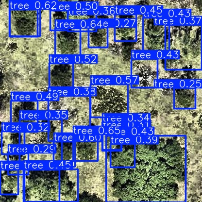
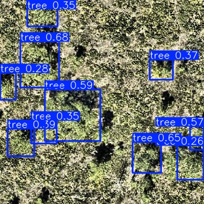
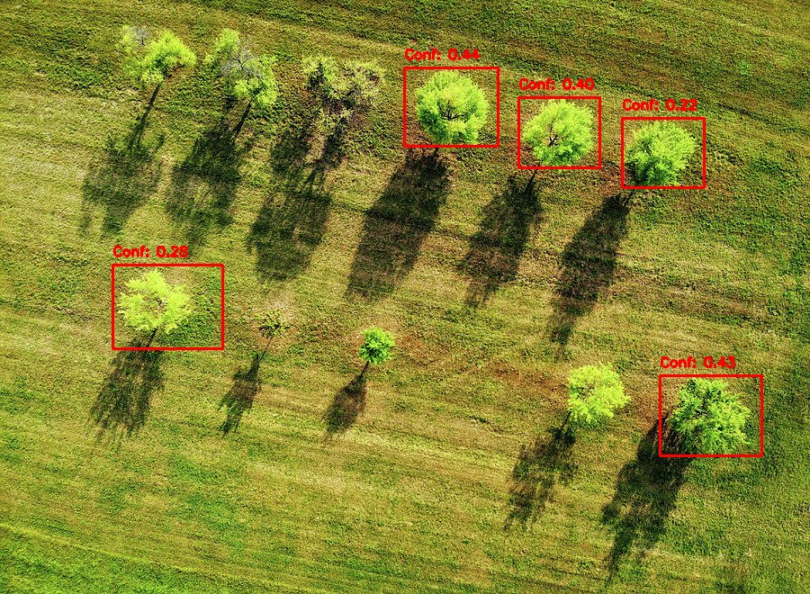
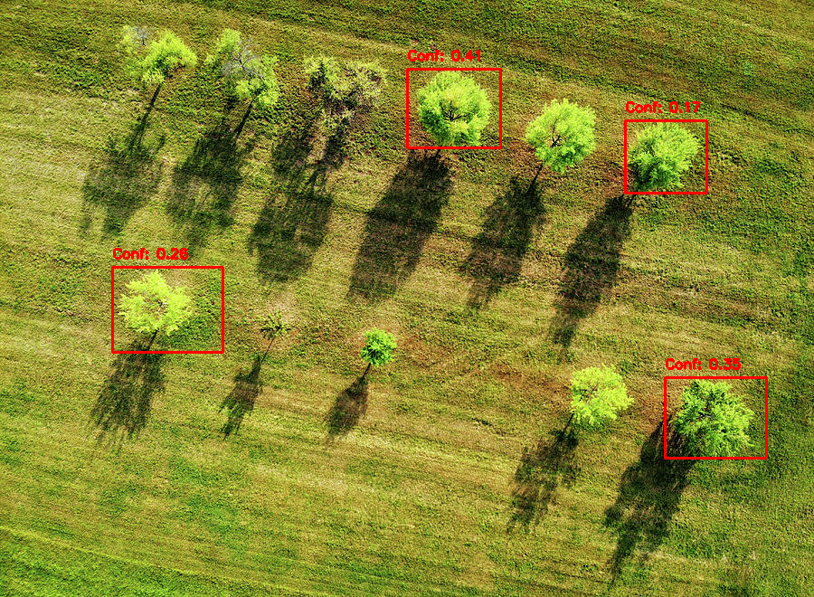

# Modelos

## Introdução

Este projeto visa a implementação e otimização de modelos de detecção de objetos utilizando a arquitetura YOLOv8, com o objetivo de rodar eficientemente em um Raspberry Pi 5. Considerando as limitações de hardware do Raspberry Pi, optamos por converter os modelos treinados para os formatos TFLite e ONNX, garantindo a viabilidade de execução no dispositivo.

## Estrutura do Projeto

O projeto foi dividido em duas etapas principais:

1. **Treinamento e Avaliação do Modelo**:
   - Utilizamos o modelo YOLOv8 para treinar em um dataset específico de árvores.
   - Avaliação do desempenho do modelo em relação à precisão de detecção e eficiência de bounding boxes.
   - Verificação da robustez do modelo ao utilizar diferentes tamanhos e posições de árvores nas imagens.

2. **Conversão e Otimização do Modelo**:
   - Conversão do modelo YOLOv8 para os formatos TFLite e ONNX, adequados para execução em dispositivos com baixa capacidade de processamento, como o Raspberry Pi 5.
   - Realização de testes de inferência para validar a precisão e eficiência do modelo convertido.
   - Implementação de técnicas de supressão de não-máximos (NMS) para otimizar as detecções de bounding boxes.

## Estratégias de Treinamento

### Treinamento com YOLOv8

O YOLOv8 foi escolhido pela sua capacidade de detecção rápida e precisa, com uma arquitetura eficiente que pode ser ajustada para modelos leves, ideal para dispositivos de borda. No treinamento, consideramos:

- **Dataset**: Um dataset customizado com imagens de árvores, focado em diferentes ambientes e densidades de árvores. [Dataset - Tree-Top-View](https://universe.roboflow.com/treedataset-clsqo/tree-top-view).

- **Configuração do Modelo**: Ajustamos hiperparâmetros como taxa de aprendizado e tamanhos de lote para otimizar o desempenho em hardware limitado.

- **Avaliação**: Implementamos técnicas de visualização de bounding boxes para validar a performance em diferentes cenários antes da conversão.

[Link do Colab - Treinamento](https://drive.google.com/file/d/1L4HlOHFmVwGWDg0S9MjdTjTKGfthfNep/view?usp=sharing)

| Result - 1 | Result - 2 |
|:--------:|:--------:|
|  |  |

### Conversão para TFLite e ONNX

Dada a necessidade de rodar os modelos em um Raspberry Pi 5, a conversão para TFLite e ONNX foi um passo crucial. A estratégia de conversão envolveu:

- **TFLite**: A conversão para TensorFlow Lite permite que o modelo seja executado eficientemente no Raspberry Pi, aproveitando as otimizações de quantização que reduzem o tamanho do modelo e a latência de inferência.
- **ONNX**: A conversão para ONNX garante que o modelo possa ser utilizado em diferentes frameworks e dispositivos, oferecendo flexibilidade adicional.

[Link do Colab - Conversão](https://drive.google.com/file/d/1oGrrnCqZr_I4NFB_r3fkGwDKiMTjMMId/view?usp=sharing)

| ONNX | TFLite |
|:--------:|:--------:|
|  |  |

### Desempenho no Raspberry Pi 5

Apesar de não termos realizado testes oficiais, tinhamos em mente o próximo passo, o desempenho do modelo em um Raspberry Pi 5, focamos nos seguintes pontos:

- **Eficiência Computacional**: A conversão e quantização do modelo para TFLite "garantem" que ele possa ser executado dentro das limitações de CPU e memória do Raspberry Pi.
- **Avaliação Pós-conversão**: Testes extensivos foram realizados para verificar se o modelo convertido mantém uma precisão aceitável e se o tempo de inferência está dentro dos limites esperados para aplicações em tempo real. Nesse primeiro momento, estamos satisfeitos e prontos para testes no dispositivo.

## Resultados e Justificativas

- **Desempenho do Modelo**: O modelo treinado apresentou uma precisão elevada durante o treinamento, **62%**, e os testes pós-conversão mostraram que o modelo manteve uma performance robusta.
- **Escolha de Arquitetura**: A arquitetura YOLOv8 foi justificada pela sua eficiência e capacidade de ser adaptada para versões leves, como as necessárias para rodar em um Raspberry Pi.
- **Conversão para TFLite e ONNX**: A decisão de converter para esses formatos foi crucial para garantir que o modelo pudesse rodar eficientemente no Raspberry Pi, mantendo a precisão e reduzindo o tempo de inferência.

## Conclusão

Esta parte do projeto demonstrou a viabilidade de treinar e converter modelos de detecção de objetos de alta precisão, como o YOLOv8, para serem executados eficientemente em dispositivos de baixa capacidade de processamento como o Raspberry Pi 5. As estratégias adotadas garantiram que o modelo mantivesse um desempenho robusto, mesmo após a conversão para formatos mais leves como TFLite e ONNX.

## Links

- [Repositório no GitHub](https://github.com/Gabi-Barretto/M11-Individual/tree/main/Sprint%202%20-%20Modelos)
- [Dataset - Tree-Top-View](https://universe.roboflow.com/treedataset-clsqo/tree-top-view)
- [Link do Colab - Treinamento](https://drive.google.com/file/d/1L4HlOHFmVwGWDg0S9MjdTjTKGfthfNep/view?usp=sharing)
- [Link do Colab - Conversão](https://drive.google.com/file/d/1oGrrnCqZr_I4NFB_r3fkGwDKiMTjMMId/view?usp=sharing)