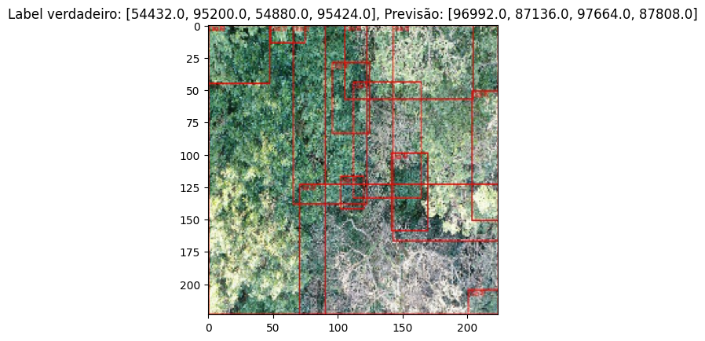
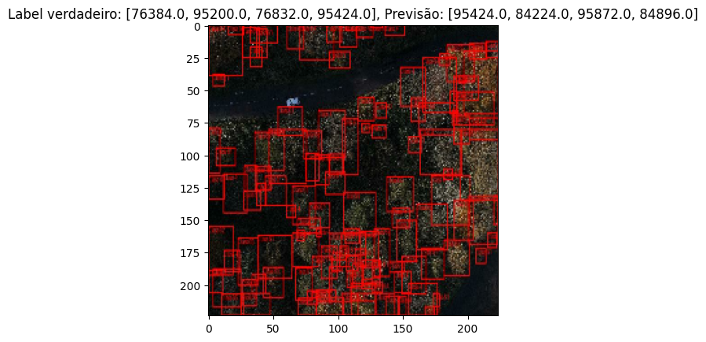

## Introdução

Este projeto visa a implementação e otimização de modelos de detecção de objetos utilizando a arquitetura **MobileNetV2**, com o objetivo de rodar eficientemente em um Raspberry Pi 5. Considerando as limitações de hardware do Raspberry Pi, optamos por converter os modelos treinados para os formatos TFLite e ONNX, garantindo a viabilidade de execução no dispositivo.

## Estrutura do Projeto

O projeto foi dividido em duas etapas principais:

1. **Treinamento e Avaliação do Modelo**:
   - Utilizamos o modelo MobileNetV2 como backbone para treinar um detector de árvores.
   - Avaliação do desempenho do modelo em termos de precisão e eficiência de detecção em diferentes ambientes.
   - Verificação da robustez do modelo ao ser aplicado em cenários com variação de densidade e posição das árvores.

2. **Conversão e Otimização do Modelo**:
   - Conversão do modelo MobileNetV2 para os formatos TFLite e ONNX, visando a execução em dispositivos com baixa capacidade de processamento, como o Raspberry Pi 5.
   - Realização de testes de inferência para validar a precisão e eficiência do modelo convertido.
   - Implementação de técnicas de supressão de não-máximos (NMS) para otimizar as detecções de bounding boxes.

## Estratégias de Treinamento

### Treinamento com MobileNetV2

O MobileNetV2 foi escolhido pela sua arquitetura leve e eficiente, ideal para dispositivos de borda como o Raspberry Pi 5. Durante o treinamento, consideramos:

- **Dataset**: Um dataset customizado assim como utilizado para o YOLOv8, com imagens de árvores em diferentes ambientes e densidades. [Dataset - Forest-Analysis](https://universe.roboflow.com/image-ai-development/forest-analysis/browse).

- **Configuração do Modelo**: Ajustamos hiperparâmetros específicos para balancear a leveza do modelo com a necessidade de precisão, maximizando a eficiência computacional.

- **Avaliação**: Implementamos técnicas de visualização de bounding boxes para verificar a precisão em diferentes cenários antes da conversão.

[Link do Colab - Treinamento](https://colab.research.google.com/drive/1tr4j_xg3WBjAzpW2tshHP19TDSp8Dcns?usp=sharing)

| Result - 1 | Result - 2 |
|:--------:|:--------:|
|  |  |

### Conversão para TFLite e ONNX

Assim como no caso do YOLOv8, a conversão para TFLite e ONNX foi um passo crucial para garantir que o MobileNetV2 pudesse ser executado eficientemente no Raspberry Pi 5. A estratégia de conversão envolveu:

- **TFLite**: A conversão para TensorFlow Lite permitiu a otimização do modelo para execução em hardware limitado, com foco na redução do tamanho do modelo e na melhoria da latência de inferência.
- **ONNX**: A conversão para ONNX proporcionou flexibilidade adicional, permitindo a utilização do modelo em diferentes frameworks e dispositivos.

[Link do Colab - Conversão](https://drive.google.com/file/d/1oGrrnCqZr_I4NFB_r3fkGwDKiMTjMMId/view?usp=sharing)

### Desempenho no Raspberry Pi 5

A previsão para o desempenho do MobileNetV2 em um Raspberry Pi 5 considerou os seguintes pontos:

- **Eficiência Computacional**: A conversão para TFLite e a aplicação de quantização "garantem" que o MobileNetV2 seja adequado para execução em um Raspberry Pi 5, respeitando as limitações de CPU e memória.
- **Avaliação Pós-conversão**: Testes extensivos pós-conversão indicaram que o modelo manteve uma precisão satisfatória e tempos de inferência adequados para aplicações em tempo real, o que reforça sua viabilidade para o uso em campo.

## Resultados e Justificativas

- **Desempenho do Modelo**: O MobileNetV2 apresentou uma precisão sólida durante o treinamento, **62%**, e os testes pós-conversão mantiveram um desempenho estável, com boas taxas de detecção e eficiência.
- **Escolha de Arquitetura**: A arquitetura MobileNetV2 foi escolhida devido à sua leveza, que é ideal para dispositivos de borda, como o Raspberry Pi.
- **Conversão para TFLite e ONNX**: A conversão foi essencial para garantir a viabilidade do modelo no Raspberry Pi, mantendo um bom equilíbrio entre precisão e tempo de inferência.

## Conclusão

Esta parte do projeto demonstrou que a MobileNetV2 é uma arquitetura eficaz para detecção de objetos em dispositivos de baixa capacidade, como o Raspberry Pi 5. As estratégias de treinamento e conversão para TFLite e ONNX garantiram que o modelo pudesse ser executado eficientemente, mantendo uma precisão robusta para aplicações em tempo real.

## Links

- [Dataset - Forest-Analysis](https://universe.roboflow.com/image-ai-development/forest-analysis/browse)
- [Link do Colab - Treinamento](https://colab.research.google.com/drive/1tr4j_xg3WBjAzpW2tshHP19TDSp8Dcns?usp=sharing)
- [Link do Colab - Conversão](https://drive.google.com/file/d/1oGrrnCqZr_I4NFB_r3fkGwDKiMTjMMId/view?usp=sharing)
