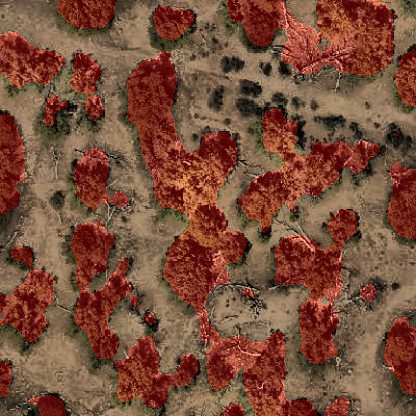
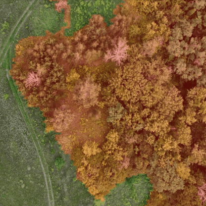

## Introdução

Esta seção do documento tem como objetivo apresentar os testes realizados para avaliar a utilização do modelo de segmentação semântica **SegFormer** na detecção de áreas florestais, com foco em sua implementação em um **Raspberry Pi 5**.

### Treinamento e Justificativas para a Utilização

Escolhemos testar a arquitetura do SegFormer por se tratar de uma abordagem inovadora, com potencial para obter resultados comparáveis a outras metodologias já exploradas. Diferentemente de testes anteriores, onde o foco foi na contagem de árvores individuais, neste caso buscamos identificar e quantificar áreas florestais inteiras. O objetivo é simplificar as iniciativas de monitoramento florestal, utilizando o SegFormer como uma ferramenta eficaz para a identificação de florestas. Consideramos as seguintes abordagens:

- **Estimativa de Densidade Florestal:** Cálculo do número de árvores por quilômetro quadrado a partir de uma escala definida na imagem, resultando em uma estimativa aproximada da densidade florestal.
- **Filtragem por Segmentação:** Utilização do SegFormer como um modelo preliminar para filtrar imagens que contenham identificação de áreas florestais, as quais seriam posteriormente analisadas por um modelo principal responsável pela contagem precisa de árvores.

Para alcançar esses resultados, utilizamos as seguintes estratégias:

- **Datasets:** Realizamos testes com diversos datasets, abrangendo diferentes regiões, tipos de vegetação, cores e planos de fundo, para assegurar a robustez do modelo.
- **Tamanho do Modelo:** O SegFormer permite a seleção entre diferentes versões de seu modelo, possibilitando o ajuste de parâmetros para equilibrar a precisão dos resultados com a necessidade de um modelo mais leve e adequado ao Raspberry Pi 5.

### Desempenho no Raspberry Pi 5

Prevemos que o modelo SegFormer possa ser um tanto exigente em termos de recursos para o Raspberry Pi 5, mas acreditamos que seja possível ajustar o modelo para melhorar seu desempenho. Nosso objetivo é encontrar um equilíbrio entre performance e acurácia, otimizando o modelo para operar eficientemente no equipamento. Entretanto, apenas testes práticos, que estão planejados para os próximos passos, poderão fornecer respostas definitivas sobre sua viabilidade.

## Conclusão e Resultados do Modelo

Os testes realizados demonstraram que o modelo SegFormer apresentou uma performance sólida e consistente, sendo capaz de detectar áreas florestais com uma acurácia de **93%**. Este resultado coloca o SegFormer como o modelo com melhor performance técnica entre os testados até o momento, o que sugere que ele tem grande potencial para ser utilizado como modelo principal em futuras iniciativas de monitoramento florestal.

| Resultado - 1 | Resultado - 2 |
|:--------:|:--------:|
|  |  |

## Links

- [Dataset - Segmentação Semântica (utilizado para treinamento)](https://universe.roboflow.com/ttt-jznky/segmentation2-apr65-bfsda)
- [Link do Colab - Treinamento](https://colab.research.google.com/drive/1GxJJXyYxwMVZ-K6nan6N6z10E98YbKzj?usp=sharing)