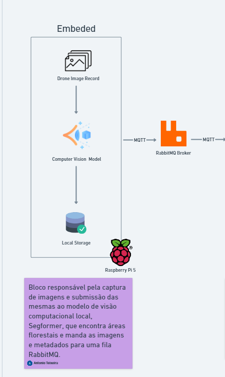
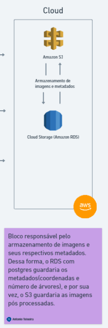
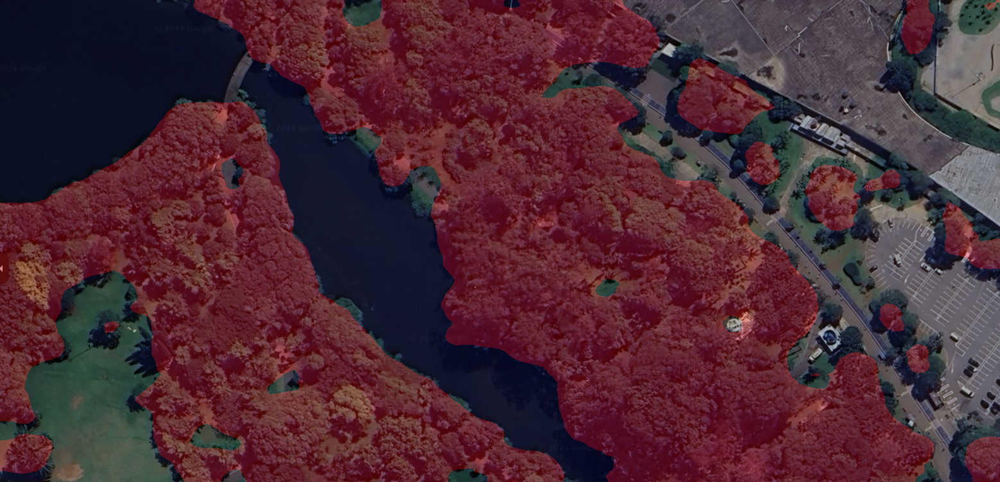
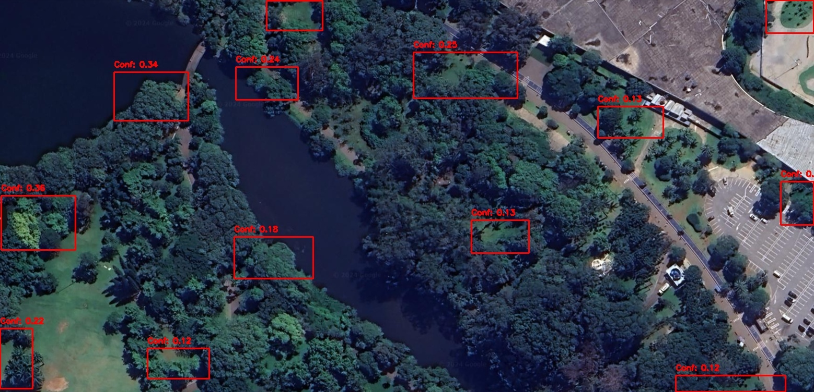
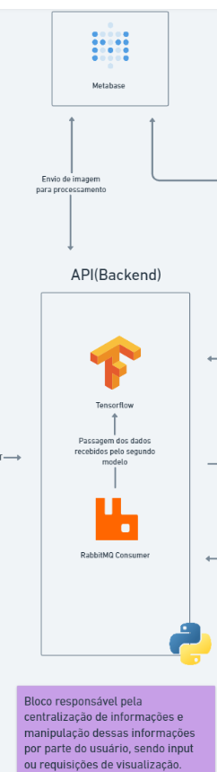
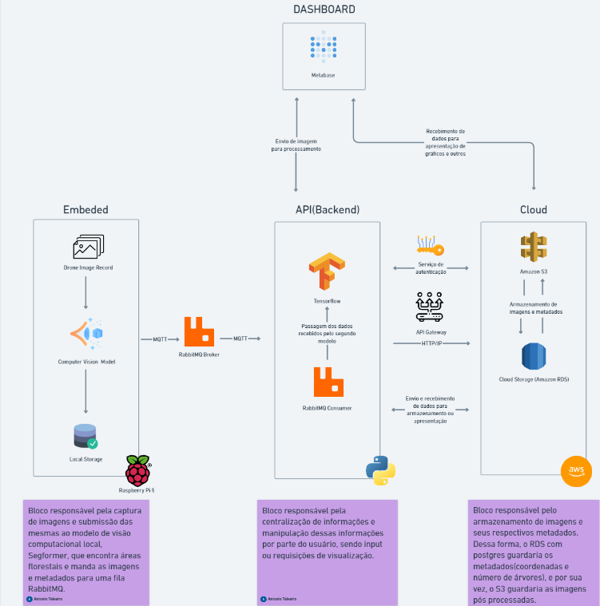

# Condições de implementação

## Introdução

### Definição do status do projeto:

**Embarcado**:

Sprint Atual:
Nesta sprint, nosso objetivo é garantir que o modelo de segmentação consiga rodar no Raspberry Pi, mesmo que com baixa performance. O foco é processar as imagens e armazená-las localmente no dispositivo. Com essa abordagem, estimamos que cerca de 80% do trabalho da sprint está concluído, já que, nesta fase, não estamos priorizando a performance de processamento, mas sim a capacidade de executar o modelo e armazenar as imagens localmente.

Sprint Final:
Para a sprint final, planejamos que o Raspberry Pi realizasse parte do processamento do modelo de forma embarcada. As imagens captadas pelo Rapsberry acoplado no drone serão submetidas ao modelo de segmentação, armazenadas localmente e, quando houver conexão à internet, serão enviadas para nossa API via protocolo MQTT. Uma vez que o envio ocorra, vamos submeter esses dados como input para o segundo modelo, que efetivamente irá fazer a contagem individual de árvores. Além disso, nossa API terá uma rota de consumo para capturar essas imagens brutas e seus metadados, podendo ser consumido para manipulação por parte do usuário. Esse fluxo de trabalho está detalhado em nossa arquitetura de blocos, no componente "Embarcado".

**Nuvem**:

Sprint Atual:
Atualmente, o status da nuvem está em 0% de conclusão, pois ainda não tivemos acesso à AWS Academy. Isso impede o início da construção da nossa arquitetura na nuvem. No entanto, já temos o design arquitetônico detalhado e, com base na experiência de módulos anteriores, acreditamos que conseguiremos implementar o ambiente na nuvem com facilidade.

Sprint Final:
Nossa arquitetura de nuvem foi planejada para garantir a maior robustez possível para o MVP. Ela inclui dois serviços principais da AWS: S3 e RDS. O S3 será utilizado como bucket para armazenar informações não estruturadas, como imagens processadas pelo modelo, enquanto o RDS armazenará os metadados, como coordenadas e quantidade de árvores identificadas em cada imagem. Dessa forma, nosso progresso quanto a sprint final encontra-se em 10%, por conta da assertividade da nossa arquitetura nesse momento.

**Modelo de segmentação**:

Sprint Atual:
Neste sprint, nosso foco foi definir claramente a arquitetura e os rumos do projeto. Para a Sprint 3, o objetivo era rodar o modelo de detecção de áreas florestais no Raspberry Pi, o que foi alcançado, embora sem considerações de desempenho nesta etapa. No Sprint 2, conseguimos testar dois modelos diferentes para a detecção individual de árvores, que serão refinados nas próximas sprints. Estimamos que 90% do trabalho deste sprint está completo, com os 10% restantes focados no aprimoramento dos modelos e nas primeiras considerações de desempenho.

Durante o segundo sprint, ao entregar os três modelos, o parceiro requisitou que fizéssemos alguns testes aplicando o modelo a alguns cenários, por exemplo, à visão de satélite do Parque Ibirapuera. A ideia principal da nossa arquitetura é realizar o processamento metade embarcado e metade na nuvem. Para isso, temos o modelo de pré-processamento que será focado no dispositivo embarcado. Esse teste mostrou-se muito satisfatório para o que esperávamos alcançar neste sprint. A ideia é submeter ao segundo modelo uma área já processada, para trabalhar somente nas áreas onde efetivamente existam árvores.

Sprint Final:
Na sprint final, pretendemos melhorar a precisão dos modelos de detecção de árvores e área florestal, otimizar a performance ao rodar os modelos, garantir uma conexão eficiente via MQTT e estruturar de forma assertiva os metadados dos modelos. Como esta etapa é voltada para refinamento e melhorias, estimamos que estamos em 50% de conclusão. 

**Modelos de detecção individual**:

**Sprint Atual:**

Nesta sprint, nosso foco foi testar o desempenho do modelo de detecção de árvores, **ONNX** e **TFLite**, que apresentaram baixa precisão em sua execução inicial no Raspberry Pi. Embora o modelo tenha sido executado corretamente e tenha produzido saídas válidas (bounding boxes), os resultados indicaram a necessidade de ajustes no treinamento e na conversão do modelo para melhorar a precisão. 

Foram realizados testes com o modelo TFLite, utilizando uma imagem de referência, mas o número de detecções foi insatisfatório. Após o processamento e a aplicação de Non-Maximum Suppression (NMS), o modelo detectou um número muito baixo de bounding boxes ou, em alguns casos, nenhum. Isso sugere que os parâmetros de confiança e as condições do dataset e treinamento precisam ser ajustados para melhorar os resultados.

Nas próximas etapas, planejamos refazer o treinamento do modelo e realizar uma nova conversão para o formato TFLite e ONNX, aplicando as lições aprendidas sobre a otimização de hiperparâmetros e o balanceamento do dataset. Esperamos que essas melhorias proporcionem uma detecção mais robusta e precisa das árvores, especialmente para aplicações em dispositivos embarcados de baixa capacidade de processamento, como o Raspberry Pi.

**Desempenho Inicial:**

- **Execução**: O modelo rodou no Raspberry Pi, mas a precisão foi insatisfatória.
- **Confiança média das detecções**: A maioria das detecções ficou abaixo do limiar de confiança desejado.
- **Número de bounding boxes detectadas**: Muito abaixo do esperado, sugerindo necessidade de ajustes.
- **Plano de ação**: Refazer o treinamento do modelo, ajustar hiperparâmetros e melhorar a conversão para TFLite.

**API**:

Sprint Atual:
Neste sprint, nosso foco foi concluir a integração do serviço de autenticação, desenvolver o serviço da API responsável pelo upload de imagens e integrar o RabbitMQ como uma fila de comunicação MQTT entre o Raspberry Pi e nossa API. Dessa forma, a equipe conseguiu concretizar a maioria dessas entregas, somente com pendências na integração MQTT estimamos que nosso sprint atual em relação à API está em 80%.

Sprint Final:
No sprint final, planejamos aprimorar a API para que ela funcione como um sistema centralizador, gerenciando o envio e recebimento de informações entre o dispositivo embarcado, a nuvem e o dashboard. A comunicação com o dispositivo embarcado será realizada por meio do protocolo MQTT, consumindo dados pré-processados e seus metadados, e passando-os para um novo modelo que fará a contagem de árvores de forma individual. Além disso, a API incluirá rotas para outros tipos de pré-processamento e integrações, como: consumo de dados pelo Metabase, upload de imagens diretamente para o modelo de contagem de árvores, e um serviço de autenticação robusto. Dessa forma, estimamos que nosso projeto em relação à API do sprint final está em 30%.

Bloco de API e suas responsabilidades:

**Dashboard**:

Sprint Atual/Final:
Embora o desenvolvimento de um dashboard estruturado não seja o foco principal do nosso grupo, o cliente demonstrou interesse em uma forma de visualização simples dos dados e na capacidade de upload de imagens quando o Raspberry Pi não for necessário. Portanto, decidimos utilizar o Metabase para esse propósito, por ser uma tecnologia com a qual já trabalhamos e de fácil implementação. Dessa forma, ainda não iniciamos o dashboard e iremos focar nessa forma de visualização para os sprints posteriores.

Essa estrutura reflete o status atual do projeto, detalha as metas para as próximas sprints e estabelece claramente os componentes e objetivos para o embarcado, nuvem, modelos, API, e dashboard.

### Prototipação:

Esta etapa envolve o desenvolvimento do produto que será entregue na Sprint 3. Durante essa sprint, nosso objetivo é desenvolver partes isoladas do sistema, sem a integração completa de todos os componentes.

**Embarcado**:
O foco do embarcado para esta sprint é executar o modelo de segmentação de áreas florestais, armazenar localmente as imagens e metadados gerados e, ao estabelecer uma conexão com a internet, enviar essas informações para uma fila RabbitMQ utilizando o protocolo MQTT.

**Nuvem**:
No bloco da nuvem, dependemos da licença da AWS Academy. Com essa licença, poderemos criar os serviços RDS e S3 e, durante o sprint, trabalharemos na integração de ambos com a API. O objetivo é garantir o acesso aos dois serviços para armazenar as imagens processadas de forma adequada.

**Modelos**:
Para este sprint, nosso foco nos modelos é o seguinte: para o modelo de segmentação, nosso objetivo é executá-lo no Raspberry Pi e armazenar as imagens localmente. Já para o segundo modelo, vamos trabalhar para aumentar a acurácia na detecção e contagem de árvores, já que durante o sprint 3 esses modelos provaram que precisam de tunagem.

**API**:
Para este sprint, nosso foco no bloco da API é desenvolver a integração entre a fila RabbitMQ e um consumer dentro da nossa API, utilizando o protocolo MQTT para a comunicação. Além disso, pretendemos finalizar o serviço de autenticação para garantir o controle de acesso do usuário, determinando o que ele pode ou não fazer. Por fim, vamos implementar o segundo serviço: uma rota para upload de imagens e a submissão dessas fotos ao modelo de detecção unitária e contagem de árvores.

**Dashboard**:
Para essa sprint, não vamos trabalhar em cima do dashboard ainda, focando em deixar a API como centralizadora robusta e começar a integração dos blocos da nossa arquitetura.

### Afiniação da visualização:

Para essa atividade, recebemos a orientação de tornar a arquitetura mais auto explicativa e fácil de visualizar. Após algumas discussões, decidimos adicionar descrições aos fluxos de integração e incluir flashcards de responsabilidades para cada bloco, visando uma compreensão mais clara e direta.

Arquitetura completa:

### Manual do usuário:

**Introdução**:
O objetivo da nossa PoC de modelo de inteligência artificial embarcado é demonstrar a viabilidade de um sistema para contagem de árvores. A proposta é otimizar e aprimorar o processo atual de contagem e monitoramento, proporcionando uma solução mais eficiente e precisa.

**Requisitos, Instalação e Configuração:**
Para utilizar nosso sistema, você precisará dos seguintes itens:

Hardware: Um Raspberry Pi 5.
Software: Um sistema de mensageria (RabbitMQ) deve estar configurado em sua arquitetura.

Passos para Instalação e Configuração:

1. Baixe o Projeto: Faça o download do nosso projeto.

2. Instale e Execute: Instale e execute o projeto no seu Raspberry Pi 5, com a câmera conectada.

3. Conecte à Internet: Após concluir a gravação das imagens, leve o Raspberry Pi a um local com conexão à Internet. O dispositivo começará automaticamente a enviar todos os dados para a sua arquitetura, especificamente para a API que os transmitirá para os serviços em nuvem.

3. Operação Básica
Funcionalidades Disponíveis:

1. Envio de Imagens do Drone: Para enviar imagens captadas pelo drone, conecte o drone a uma rede com acesso à Internet. As imagens serão enviadas automaticamente para o armazenamento.

2. Envio de Imagens via Front-End para Processamento: Acesse nosso dashboard, selecione a opção “Envio para Processamento” e escolha a imagem desejada. Em poucos segundos, você receberá o retorno da imagem já processada.

3. Criação de Gráficos para Monitoramento: É possível criar gráficos para análise com base nas imagens enviadas ao sistema. Acesse o link do nosso dashboard, crie sua conta e clique em “Adicionar Nova Exibição” para criar e personalizar gráficos com os dados disponíveis no banco de dados.

### GESTALT:

Na atividade de definição de status de projeto, os princípios da psicologia da Gestalt ajudam a melhorar a percepção e compreensão das informações apresentadas, organizando elementos visuais em grupos ou padrões que facilitam a interpretação do todo.

**Princípios da Gestalt Aplicados**:

1. Princípio da Proximidade: Agrupamentos visuais destacam elementos relacionados, como "Embarcado", "Nuvem", "Modelos", "API", e "Dashboard", organizados em blocos ou seções claramente definidos para evidenciar contextos e relações entre diferentes componentes do projeto.

2. Princípio da Semelhança: Cores, ícones, ou estilos consistentes são usados para elementos com funções semelhantes, criando um padrão visual que facilita a navegação e a distinção, como o uso de uma cor para o status atual e outra para metas futuras.

3. Princípio da Continuidade: O fluxo visual guia o leitor através das etapas do projeto com o uso de setas, linhas, ou um layout linear que mostra a progressão das sprints ou a transição entre componentes, por exemplo, "do Embarcado para a Nuvem" ou "da API para o Dashboard".

4. Princípio da Figura-Fundo: Informações importantes são destacadas por meio de contraste visual, como texto em negrito, caixas de destaque, ou fundos coloridos, diferenciando o conteúdo principal (figura) das informações secundárias (fundo).

5. Princípio do Fechamento: Diagramas ou mapas mentais permitem que o leitor infira a continuidade ou conexões entre diferentes componentes, mesmo quando não estão explicitamente desenhados, aproveitando a tendência do cérebro de preencher lacunas para criar formas ou ideias completas.

6. Princípio da Pregnância (Simplicidade): Elementos visuais permanecem simples e claros, com layouts limpos e sem excesso de detalhes desnecessários, promovendo uma transmissão direta e eficiente da informação.

Esses princípios facilitam a compreensão de informações complexas, destacam o que é mais relevante e melhoram a comunicação do status do projeto.

