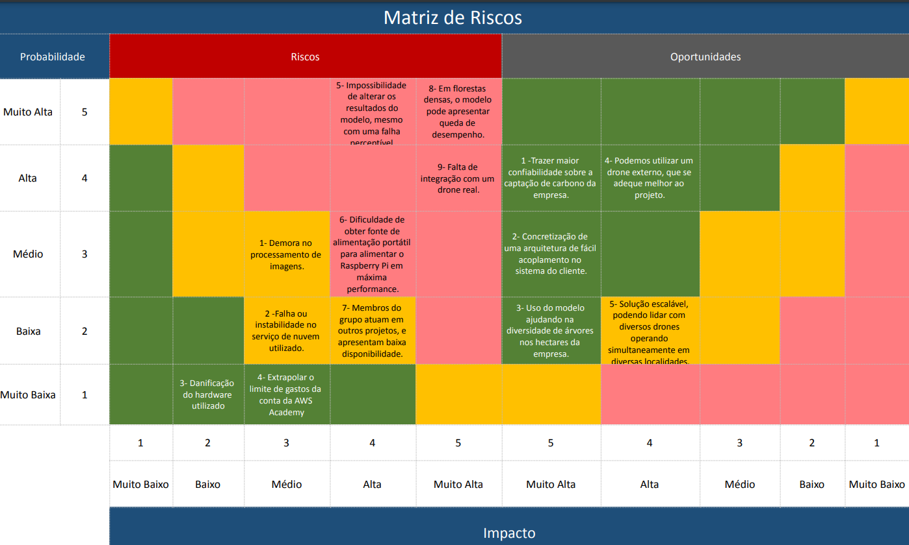

# Matriz de risco

## Introdução
Uma **matriz de risco** é uma ferramenta visual utilizada para identificar, avaliar e priorizar riscos associados a um projeto, processo ou atividade. Ela organiza riscos em uma tabela bidimensional, onde cada risco é posicionado de acordo com a probabilidade de sua ocorrência (eixo vertical) e o impacto ou severidade que teria caso ocorra (eixo horizontal). O cruzamento desses dois eixos resulta em diferentes categorias de risco, geralmente classificadas como baixo, médio, alto ou crítico.

### Principais Usos da Matriz de Risco:

1. **Identificação e Avaliação de Riscos**:
   - Ajuda a identificar todos os riscos potenciais associados a um projeto ou atividade, e a avaliá-los de forma sistemática. 

2. **Prioritização de Riscos**:
   - Permite que riscos sejam classificados de acordo com sua gravidade, auxiliando na priorização de ações preventivas ou corretivas. Os riscos de alta probabilidade e alto impacto são tratados com maior urgência.

3. **Comunicação de Riscos**:
   - Facilita a comunicação e o entendimento dos riscos entre os membros da equipe e as partes interessadas. A visualização clara ajuda a transmitir rapidamente quais riscos são mais críticos.

4. **Tomada de Decisão**:
   - Fornece uma base sólida para a tomada de decisões estratégicas sobre como gerenciar os riscos. As decisões podem incluir evitar, transferir, mitigar ou aceitar os riscos identificados.

5. **Monitoramento Contínuo**:
   - É usada para monitorar continuamente os riscos ao longo do tempo, permitindo ajustes nas estratégias de mitigação conforme novas informações ou mudanças no contexto do projeto ocorram.

6. **Documentação e Compliance**:
   - Serve como um registro formal dos riscos identificados e das ações planejadas, o que pode ser útil para fins de auditoria, compliance e aprendizado organizacional.

## Riscos e suas mitigações:

**Risco 1 - Processamento de imagens levando muito tempo**:

O risco de número 1 consiste na demora no processamento das imagens. Esse risco trata-se de um risco contido em um bloco de embarcado e de api, onde estão contidos os dois modelos. Nosso medo consiste na não otimização do modelo tanto para de segmentação, que roda no rasp, tanto para o que roda na API.

**Mitigação - Risco 1**:
Como mitigação do primeiro risco, o grupo discutiu e chegou à conclusão de que devemos focar na otimização dos modelos de forma concentrada durante uma sprint inteira. Dessa forma, vamos conseguir com que o modelo de pré-processamento e de processamento da API rode de forma eficiente e não entregue um resultado com latêcnia para o usuário final.

**Risco 2 - Falha ou instabilidade no serviço de nuvem utilizado**:
O risco de número 2 consiste na instabilidade do serviço de nuvem, ou seja, demora e erros de conexão entre nossos blocos da arquitetura.

**Mitigação - Risco 2**:
A fim de mitigar o risco de instabilidade, devemos fazer com que nossa arquitetura não dependa demais da estrutura em cloud, mantendo metade do processamento na borda e comunicando com o segundo processamento por meio do MQTT, protocolo escolhido pela possibilidade de armazenamento local e envio dos metadados e imagens ao se estabelecer conexão com a internet. 

**Risco 3 - Danifinição de hardware utilizado**:
O risco de danificação do hardware se encontra no fato de utilizarmos o raspberry acoplado ao drone e isso poder gerar instabilidade durante o voo. 

**Mitigação - Risco 3**:
A mitigação para esse erro foi discutido no grupo e chegamos à conclusão que uma documentação de testes seria viável para contornar esse risco, focando em saber quais são as limitações do hardware e como manter um bom uso do mesmo.

**Risco 4 - Extrapolar o limite de gastos da conta AWS**:
Esse risco aumentou muito durante esse sprint que começamos a utilizar a AWS. Nesse módulo, estamos utilizando a academy, porém com menos saldo em relação aos últimos módulos. Resultando em uma menor quantidade de créditos para gastar com a arquitetura.

**Mitigação - Risco 4**:
A fim de mitigar o estouro de créditos da AWS devemos focar nossa arquitetura em serviços cruciais e mantê-los em pé somente quando formos, efetivamente, utilizar o sistema de armazenamento em nuvem.

**Risco 5 - Impossibilidade de alterar os resultados do modelo**:

Durante a entrega do sprint 3, o parceiro demonstrou interesse na alteração manual dos resultados do modelo. Por exemplo, em um planalto que o modelo acusar 3 árvores, porém tiver 4, ele quer ter a possibilidade de alterar o resultado, apontando qual o verdadeiro resultado.
**Mitigação - Risco 5**:

Nosso MVP não contempla essa funcionalidade de alteração de resultados, poré, podemos manter um esforço nesse sentido, documentando os próximos passos da aplicação e deixando claro os caminhos a se seguir a fim de adicionar essa funcionaldiade ao sistema.

**Risco 6 - Alimentação portátil para o Raspberry**:
O rapberry é um IoT e como toda tecnologia desse tipo uma das maiores dificuldades dessa tecnologia é a duração da bateria, que pode acabar sendo agravado pelo peso do adicionado ao drone.

**Mitigação - Risco 6**:
A fim de mitigar esse problema com a bateria, podemos realizar alguns testes para termos uma média de quanto tempo a bateria irá durar agora que o peso do raspberry está presente. Dessa forma, conseguimos utilizar o drone de forma assertiva, sem riscos para o sistema e para o hardware.

**Risco 7 - Membros do grupo atuando em outros projetos**:
Atualmente todos os membros do grupo atuam como estagiários, trabalhando em alguns outros projetos além da faculdade e, dessa forma, não tendo tanto tempo para focar muito no projeto atual.
**Mitigação - Risco 7**:
Para mitigar esse risco e as consequências que podem vir com ele, o grupo deve fazer um plano de estratégia, a fim de que cada membro pegue uma parte que efetivamente consiga fazer e uma organização por sprint que caiba nas nossas vidas atuais.

**Risco 8 - Florestas densas demais para o modelo**:
O modelo de detecção de árvores pode não funcionar bem em florestas, esse risco pode vir a se concretizar, mesmo com nossa arquitetura tendo dois processamentos diferentes para contagem de árvores.
**Mitigação - Risco 8**:
A fim de mitigar esse risco, podemos treinar o segundo modelo com um dataset de árvores denso, a fim de saber como esse modelo se saí. Além disso, focar em plantações que tenham uma densidade menor seria uma boa possibilidade.

**Risco 9 - Falta de integração com o drone real**:
O drone utilizado para testar o sistema pode não ter a mesma configuração do drone que será utilizado no cotidiano da empresa, podendo gerar inconsistências quanto ao plano de voo, captura de imagens e tempo de voo.
**Mitigação - Risco 9**:
A fim de mitigar esse risco e suas consequências, poderíamos projetar focado no drone que o parceiro realmente utilizará, focalizando nosso plano e manual de usuário para o hardware que o parceiro tem.

### Matriz de Riscos e Mitigações

**Risco 1 - Processamento de imagens levando muito tempo**:  
Este risco refere-se à possível demora no processamento das imagens, tanto na borda (no Raspberry Pi) quanto na nuvem (API), devido à falta de otimização dos modelos de segmentação utilizados em ambas as partes da arquitetura.

- **Mitigação**: Para mitigar esse risco, o grupo decidiu dedicar uma sprint inteira focada na otimização dos modelos de processamento e pré-processamento, garantindo assim uma execução eficiente e sem latência perceptível para o usuário final.

**Risco 2 - Falha ou instabilidade no serviço de nuvem utilizado**:  
Existe o risco de instabilidade nos serviços de nuvem, que pode resultar em atrasos ou falhas na comunicação entre diferentes componentes da arquitetura.

- **Mitigação**: A mitigação consiste em reduzir a dependência dos serviços em nuvem, mantendo metade do processamento na borda e utilizando o protocolo MQTT. Esse protocolo permite o armazenamento local e o envio de metadados e imagens assim que a conexão com a internet for restabelecida.

**Risco 3 - Danificação do hardware utilizado**:  
O hardware, especificamente o Raspberry Pi acoplado ao drone, corre o risco de danificação devido a possíveis instabilidades durante o voo.

- **Mitigação**: Para mitigar este risco, será criada uma documentação de testes detalhada, que ajudará a entender as limitações do hardware e a assegurar um uso apropriado do mesmo durante as operações.

**Risco 4 - Extrapolar o limite de gastos da conta AWS**:  
Há um risco significativo de ultrapassar o limite de créditos disponíveis na conta AWS, principalmente durante as fases intensivas de utilização.

- **Mitigação**: Para mitigar esse risco, a arquitetura será ajustada para que somente os serviços cruciais permaneçam ativos, garantindo que os recursos em nuvem sejam utilizados apenas quando necessário.

**Risco 5 - Impossibilidade de alterar os resultados do modelo**:  
O parceiro demonstrou interesse em ter a capacidade de alterar manualmente os resultados gerados pelo modelo, o que atualmente não é contemplado no MVP.

- **Mitigação**: Documentar os passos futuros necessários para implementar essa funcionalidade e definir claramente os próximos passos para adicioná-la ao sistema em uma versão futura.

**Risco 6 - Alimentação portátil para o Raspberry**:  
Como o Raspberry Pi depende de alimentação portátil, há um risco de esgotamento rápido da bateria, especialmente considerando o peso adicional quando acoplado ao drone.

- **Mitigação**: Realizar testes para determinar a duração média da bateria com o peso adicional do Raspberry Pi. Isso permitirá um uso mais eficaz do drone, minimizando os riscos para o sistema e o hardware.

**Risco 7 - Membros do grupo atuando em outros projetos**:  
Todos os membros do grupo estão envolvidos em outros projetos, o que limita o tempo disponível para focar no projeto atual.

- **Mitigação**: Desenvolver um plano estratégico para distribuir as tarefas de forma que cada membro assuma responsabilidades que caibam em sua agenda, organizando o trabalho por sprints que sejam gerenciáveis dentro das limitações atuais.

**Risco 8 - Florestas densas demais para o modelo**:  
O modelo de detecção de árvores pode apresentar dificuldades em áreas de floresta densa, mesmo com a utilização de dois processamentos diferentes para a contagem de árvores.

- **Mitigação**: Treinar o segundo modelo com um dataset mais denso de árvores para melhorar a precisão. Além disso, priorizar o uso do modelo em áreas com menor densidade arbórea.

**Risco 9 - Falta de integração com o drone real**:  
O drone utilizado para testes pode não ter a mesma configuração do drone que será utilizado no cotidiano da empresa, gerando inconsistências na operação.

- **Mitigação**: Desenvolver o sistema focando no drone específico que será utilizado pela empresa, adaptando o plano de voo, captura de imagens, e outras especificações para o hardware real, além de ajustar o manual do usuário conforme o equipamento disponível.

Essa matriz de riscos proporciona uma visão clara dos desafios potenciais e das estratégias definidas para minimizá-los, garantindo um gerenciamento de riscos eficaz ao longo do projeto.

### Oportunidades e suas Acentuações

**Oportunidade 1 - Confiabilidade para a empresa**:  
Como o conceito de ESG (ambiental, social e governança) ainda é relativamente novo no mundo corporativo, construir confiança é crucial para atrair novos clientes e fortalecer a reputação da empresa. Nosso sistema pode contribuir para isso, oferecendo, em etapas futuras, a possibilidade de criar um "mapa" que mostre a localização exata das árvores adquiridas pelos clientes.

- **Acentuação**: Para destacar essa oportunidade, o sistema deve incluir funcionalidades adicionais não contempladas no MVP, como a exibição de coordenadas geográficas específicas das árvores e a geração de tokens reconhecíveis que representem essas informações.

**Oportunidade 2 - Arquitetura flexível para integração**:  
A arquitetura do sistema foi projetada para ser facilmente integrada à plataforma já existente do parceiro, focando na criação de uma API robusta que possa ser facilmente acoplada ao sistema atual.

- **Acentuação**: Para enfatizar essa oportunidade, a abordagem escolhida não prioriza o desenvolvimento de um dashboard ou de um sistema completamente novo. Em vez disso, a ênfase está em uma arquitetura robusta e altamente integrável, pronta para ser conectada ao sistema existente.

**Oportunidade 3 - Diversidade de árvores nos hectares da empresa**:  
A empresa demonstrou interesse no reconhecimento individual das árvores em termos de espécies, o que pode ser um ponto positivo para promover a diversidade de espécies e fomentar um mercado local baseado nos produtos gerados por diferentes espécies.

- **Acentuação**: Para acentuar essa oportunidade, o sistema pode ser aprimorado para identificar e catalogar diversas espécies de árvores, permitindo um controle mais detalhado da biodiversidade e apoiando estratégias de mercado que valorizem essa diversidade.

**Oportunidade 4 - Utilização do drone da empresa**:  
Em vez de utilizar o drone de testes do INTELI, que não atende completamente às nossas necessidades, podemos realizar testes diretamente com o drone que será utilizado pela empresa no dia a dia.

- **Acentuação**: Para destacar essa oportunidade, realizaremos testes com o drone utilizado cotidianamente pela empresa, documentando os resultados e garantindo que o sistema seja totalmente compatível com o hardware que será usado em operações reais.

**Oportunidade 5 - Solução escalável**:  
O sistema foi projetado para ser escalável, permitindo que a empresa aumente o número de drones e o uso da tecnologia sem comprometer a performance ou a estabilidade.

- **Acentuação**: Para acentuar essa oportunidade, serão realizados testes de carga e estresse durante a próxima sprint, focando em demonstrar a capacidade do sistema de lidar com escalas maiores sem perda de eficiência.

Essa estrutura proporciona uma visão clara de como o projeto pode maximizar as oportunidades, destacando aspectos que são estratégicos para o crescimento e a consolidação da empresa no mercado. Dessa forma, esperamos que mapeando esses possíveis rumos que o projeto pode tomar e planos de contingência para esses, possamos agregar maior valor para o parceiro e entregar o melhor MVP possível.